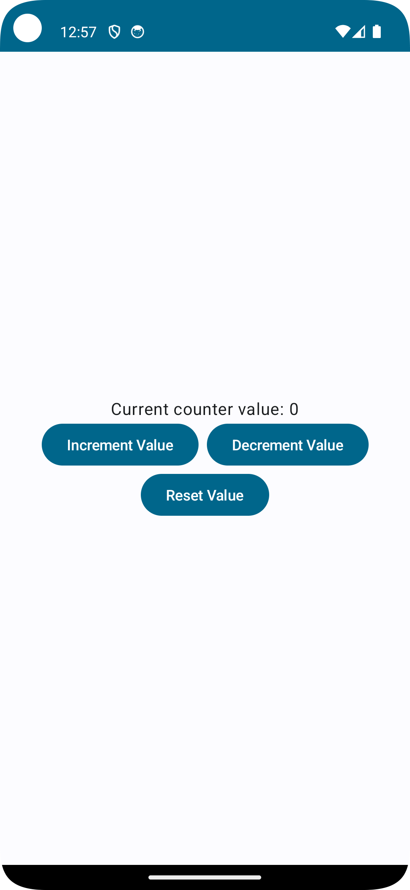
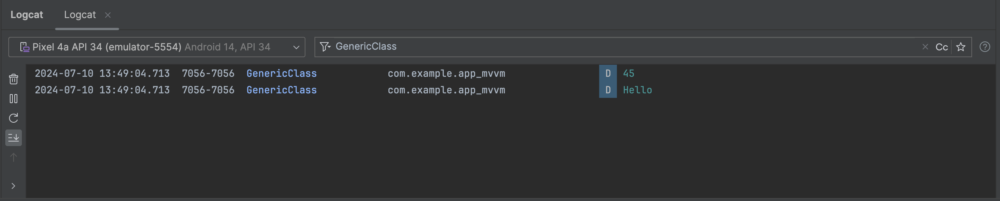

## MVVM (Model-View-ViewModel)
MVVM is a popular architectural pattern, especially for modern UI frameworks like WPF, SwiftUI, and Android Jetpack Compose. It divides the application into three core components:

1. **Model**
    - Handles the data and business logic.
    - Responsible for data retrieval, storage, and manipulation, often using a mix of server-side data, local databases, or third-party libraries.

2. **View**
    - Comprises the UI components.
    - Displays data to the user and sends user commands to the ViewModel.
    - Should be kept as "dumb" as possible, containing no business logic and remaining independent of application logic.

3. **ViewModel**
    - Serves as an intermediary between the View and the Model.
    - Manages presentation logic and prepares data for the View.
    - Observes changes in the Model and updates the View accordingly.

### Benefits of MVVM
- Increased Cohesion: Clear responsibilities for each component.
- Decreased Coupling: The View is independent of the business logic.
- Testability: The ViewModel can be tested without the UI.
- Maintainability: Separation of concerns makes the code easier to manage and update.

## MVC (Model-View-Controller)
MVC is another architectural pattern that separates an application into three components:

1. **Model**
    - Manages the data and business logic.

2. **View**
    - Displays the data to the user.

3. **Controller**
    - Handles user input and interactions.
    - Communicates with the Model to update the View.

### Benefits of MVC
- Separation of Concerns: Clear division of responsibilities.
- Scalability: Easier to develop and scale as components can be worked on independently.

## MVP (Model-View-Presenter)

MVP is similar to MVC but with distinct roles for each component:

1. **Model**
    - Manages the data and business logic.

2. **View**
    - Displays data to the user and forwards user actions to the Presenter.

3. **Presenter**
    - Acts as an intermediary between the View and the Model.
    - Fetches data from the Model and prepares it for the View.

### Benefits of MVP
- Improved Modularity: Each component has a well-defined responsibility, making the code more modular.
- Ease of Testing: The Presenter can be tested independently of the View and Model, enhancing testability.
- Flexibility: Changes in the View do not affect the Presenter or Model, and vice versa, making it easier to modify and extend each component.

## Generics in Kotlin
Generics in Kotlin allow you to write flexible, reusable code while ensuring compile-time type safety. They enable classes and methods to operate on objects of various types.

## Preview
    
## Preview of Generics

